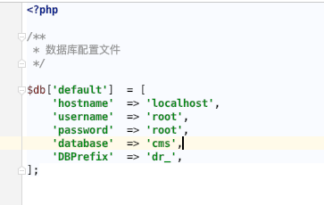
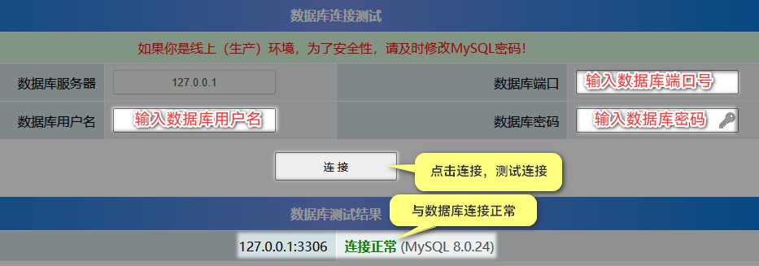

# 数据库配置文件

系统框架的数据库配置文件是：

```
config/database.php
```



以上参数分别代表是：

```
服务器地址
数据账号
数据库密码
数据库名称
数据表前缀
```

带端口的写法是：127.0.0.1:330

### **如何验证数据库是否可用呢？**

1、使用PHP环境侦探工具
:fa-regular fa-file-zipper: [探针.zip](https://files.13aq.com/探针.zip)

2、将以上的数据库信息填写到下方进行连接测试

