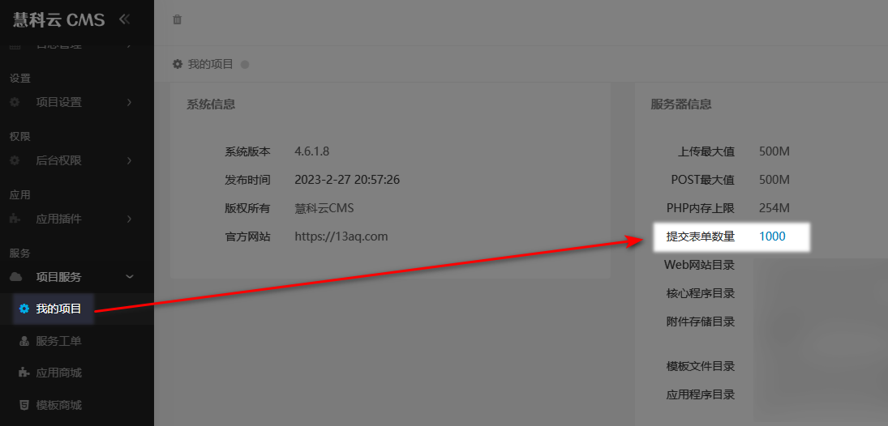
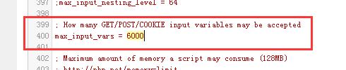

# 

当在保存内容时出现部分内容没有保存成功的情况，

例如在用户权限配置时没法前面部分可以保存成功，但是后面部分没有保存成功，说明post数据超限了，设置方法：

在php.ini找到 `max_input_vars`

用来限制提交的表单数量，默认值为 1000， 如果你网站栏目太多的话，而且需要配置用户权限的时候会发现无法保存，这时候说明这个值太小了，设置6000 ~ 10000一般够用。
